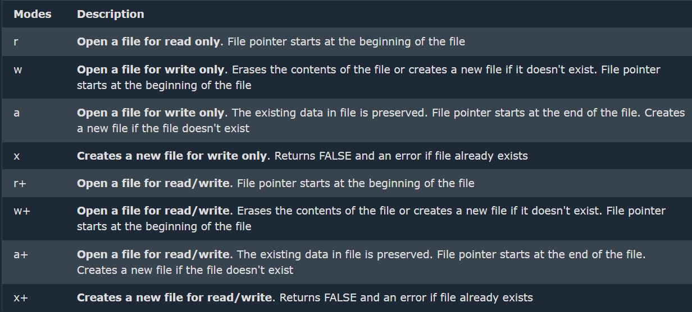

# Apuntes servidor

- ### Variables
  - >`Define('name', value)`: Definir constantes
  - >**Variable variables**: permite utilizar el valor de una variable como el nombre de otra variable.

   

- ### Bucles
  - >`for(varibale; condicion; incremento)`
  - >`while(condicion)`
  - >`do{codigo} while(condicion)`
  - >`foreach(array as value) | foreach(array as key => value)`: key se refiere a la posición _array[0]_ o al nombre en caso de ser asociativo _array['name']_ 

- ### Condicionales
  - >`if(condicion) | else(condicion) | else if(condicion)`
  - >`swith(condicion){case "value": //código break;}`

- ### Expresiones regulares
  - #### Funciones
    - >`preg_replace (pattern, replacement, string)`:examina la cadena en busca de coincidencias de patrón y sustituye el texto encontrado por el texto de sustitución.
    - >`preg_split(pattern, string, limite)`: Devuelve una matriz o lista de cadenas con el resultado de todas las apariciones del patrón en la cadena. Podemos especificar opcionalmente un límite de cadenas devueltas.
    - >`preg_match(pattern, string)`: comprueba si el patron y el string coincide **return bool**
  - #### Sintaxis
    - >preg_match("/^  $/", string) | ejemplo: (0[0-9] | 1[0-9] | 2[0-3], 23)
  * * *
  

    
    
  

- ### Arrays
  - #### Tipos
    - >**Numerico**: la key es un numero _array[0]_
    - >**Asociativo**: la key es un string _array['name']_
    - >**Multidimensional**: tiene varias dimensiones que pueden ser tanto numericas como asociativas _array[0]['name']_  
  - #### Funciones
    - >`count(array)`: cuenta el numero de elementos(values)
    - >`sort(array) | rsort(array)`: ordena arrays con elementos numericos (les cambia la key/index) _array(10, 3, 8, 1, 6)_
    - >`asort(array) | arsort(array)`: ordena asociativos por el value 

         

    - >`ksort(array) | krsort(array)`: ordena asociativos por la key 

         

    - >`usort(array, function)`: ordena un array según la función que el usuario defina como segundo parámetro.
    - >`array_filter(array, funcion_filtrado)`: devuelve un array con los elementos del array original que pasan la función de filtrado indicada.
**Nota:** Después de ser ejecutado el puntero se mueve a la siguiente linea

    - >`print_r()`: para imprimir un array
- - -
>**Nota**: <=> Spaceship $x <=> $y Devuelve un entero menor, igual o mayor que cero, dependiendo de si $x es menor, igual o mayor que $y.
- - -

- ### Text handling
  - >`trim()`: **quitar espacios** tanto delante como detras del string
  - >`number_format(number, decimals)`: muestra los decimales especificados
  - >`htmlspecialchars()`: formatea caracteres especiales a html
  - >`strtoupper()`: convierte el string a mayúsculas
  - >`strtolower()`: convierte el string a minúsculas
  - >`explode(separator, string)`: separa el string por el separador indicado **return array()**
  - >`implode(separador, array)`: junta el array en un string y los separa por el separador **return string**
  - >`strcmp(string1, string2)`: compara que string es mas largo
  - >`strlen(string)`: numero de caracteres
  - >`strpos(string, part)`: posición en la que empieza **part**(es un string)
  - >`str_replace(oldchain, newchain , string)`: reemplaza **newchain** por **oldchain** dentro del string dado

- ### Handling dates and times
  - >`time()`: da el número de segundos que han transcurrido desde el 1/1/1970
  - >`checkdate(month, day, year)`: compueba si la fecha esta bien **return bool**
  - >`date(format, date)`: obtiene una cadena de texto formateando la fecha con el formato indicado
  - > `strtotime(text)`: convierte un texto que intenta representar una fecha en una fecha determinada

- ### File handler
  - >`fopen(path, mode)`; abre el archivo o lo crea si no existe 

  - >`fclose(path)`; cierra el archivo
  - >`file_exists($fichero)`; compueba si el archivo existe **devuelve booleano** 
  - >`readfile(file)`: lee un archivo entero y lo vuelca en el búfer de salida (es decir, en la página que se está generando, si estamos en una página PHP).
  - >`file('file', FILE_IGNORE_NEW_LINES)`: lee un fichero entero y devuelve un array o lista, donde en cada posición hay una línea del fichero
  - >`file_get_contents()`: lee un archivo entero y lo devuelve en un string (no en una matriz, como la anterior)
  - >`file_put_contents (file, text)`: sobrescribiendo su contenido anterior si lo tenía. para añadir se pone esto como tercer parámetro FILE_APPEND.
  - >`filesize($file)`: devuelve el tamaño en bytes del archivo, o FALSE si no existe
  - >`fget()`: se utiliza para leer una sola linea del archivo (si no se especifica lee la 1º linea)
  - >`feof()`: ("end-of-file") Comprueba si se ha alcanzado la ultima linea del archivo. Util para recorrer archivos de longitud indefinida.
  - >`fgetc()`: leer un solo carácter del archivo (se suele utilizar en bucles).
  - >`fwrite($file, $string)`: escribir en un archivo.

- ### Modularizar codigo
  - Reusar codigo en diferentes sitios.
  - >`include`: inlcuye siempre (si no se puede da un aviso pero carga la pagina)
  - >`include_once`: solo incluye si no se ha incluido ya
  - >`require`: emite un error si no se ha podido incluir (no carga la pagina)
  - >`rquire_once`: igual que el anterior pero lo incluye si no ha sido incluido

- ### Error management
  - >**Operador @**: se pone delante de una operación y no muestra nada en caso de error
  - >**Modificar php.ini**: _display_errors = (false, off o "0")_ (mala practica)
  - >**die() o exit;**: Ejemplo: `file_exists("file.txt") or die ("File not found");`
  - >**Uso de excepciones**: con `try{codigo} catch(Exception ex){codigo}` try ejecuta un codigo y catch coge cualquier tipo de exception si la hay.

- ### Cookies
  - Una cookie se utiliza a menudo para identificar a un usuario.
  - >`setcookie(name, value, expire, path, domain, secure, httponly)`: crear cookie (solo name es obligatorio).
  - >**Eliminar:** Se pone el expire en negativo.
  - >`$_COOKIE['name']`: para utilizar la cookie.
  - >**Comprobar si hay cookies:**`if(count($_COOKIE) > 0){echo "Cookies are enabled."}` 

- ### Session
  - Una sesión es una forma de almacenar información (en variables) para utilizarla en varias páginas.
  - >`session_start()`: Iniciar una session.
  - >`$_SESSION["name"] = "value";`: Para darle valor a una session.
  - >`$_SEESION['name']`: Utilizar la variable.
  - >**Eliminar:**
    >> - `session_unset()`: Elimina todas las variables de session.
    >> - `session_destroy()`: Destruye la session.

>**Nota:** La función session_start() debe ser lo primero en su documento. Antes de cualquier etiqueta HTML. Tiene que estar en cualquier pagina que se utilice la variable *$_SEESION['name']*

- ### AJAX - PHP
  - **Definición:** AJAX permite actualizar páginas web de forma asíncrona intercambiando pequeñas cantidades de datos con el servidor. Esto significa que es posible actualizar partes de una página web sin recargara entera.
  - >`const xmlhttp = new XMLHttpRequest()`: inicializar y declarar la respuesta http.
  - >`xmlhttp.onreadystatechange = function() {}`: Cuando la respuesta este preparada ejecutara la función.
  - >`if (this.readyState == 4 && this.status == 200)`: Comprueba que el servidor este levantado. (dentro de este if se pone el cambio que se quiere hacer en el html)
  - >`xmlhttp.open("METHOD", "pagina.php", true);`: method puede ser get o post, pagina.php la pagina de la que vamos a obtener la respuesta.
  - >`xmlhttp.send()`: Para enviar el xmlhttp.
  - >`this.responseText`: Para obtener el texto que devuelva pagina.php
  